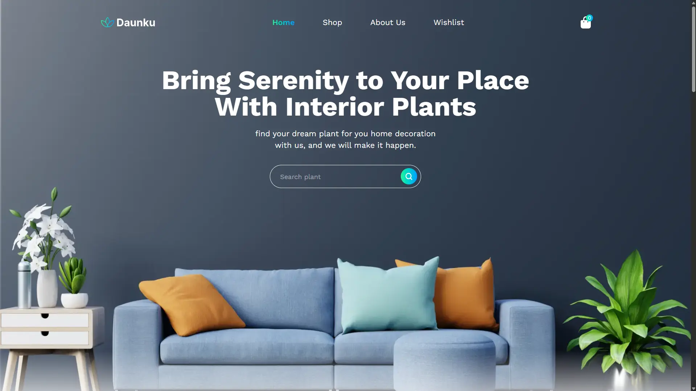
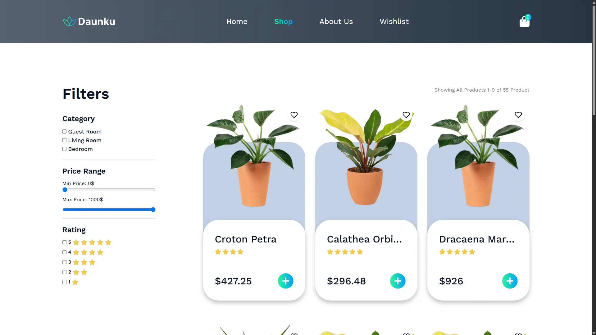
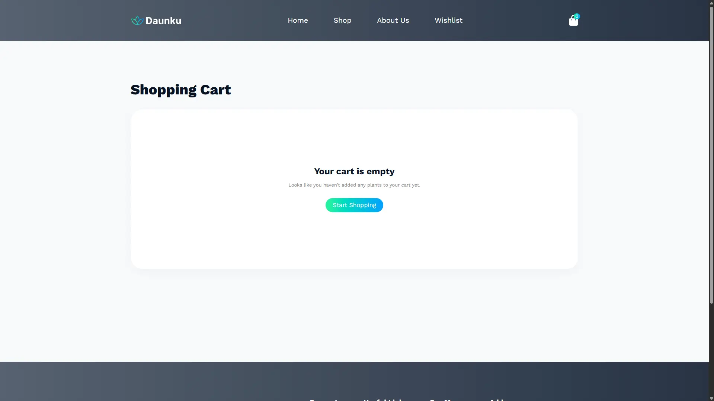
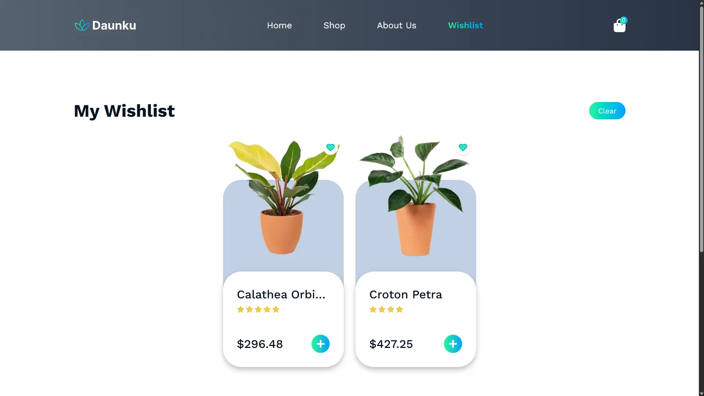

<div align="center">

  

  <h1>🌿 GreenLeaf — Online Plant Store</h1>

  <p>
    <strong>A modern, fully-featured e-commerce experience for plant lovers.</strong><br/>
    Browse, filter, wishlist, and cart your favorite plants — all in a beautifully designed React web app.
  </p>

  <p>
    
    
    
    
    
  </p>

  <p>
    <a href="https://github.com/mohamedmagdy-dev/Online-plant-store">
      
    </a>
    <a href="https://github.com/mohamedmagdy-dev/Online-plant-store/issues">
      
    </a>
  </p>

</div>

---

## 📖 Overview

**GreenLeaf** is a feature-rich, single-page e-commerce application built for plant enthusiasts. It provides a seamless shopping experience from browsing to checkout, with a clean and premium UI.

The application is built with **React 19**, powered by **Redux Toolkit** for scalable state management, styled with **Tailwind CSS v4**, and bundled with **Vite** for lightning-fast development and builds.

> 🌱 *Whether you are looking for a rare succulent or a lush tropical plant, GreenLeaf makes it easy to find, save, and buy your next green companion.*

---

## 🖼️ Screenshots

| Home Page | Shop Page |
|-----------|-----------|
|  |  |

| Cart Page | Wishlist Page |
|-----------|---------------|
|  |  |

> 📸 *Add your screenshots to `public/screenshots/` and update the paths above.*

---

## ✨ Features

- 🏪 **Product Catalog** — Browse a rich collection of plants fetched from a local API
- 🔍 **Advanced Filtering** — Filter by category, price range, and star rating simultaneously
- 🛒 **Shopping Cart** — Add, remove, increase/decrease quantities, and clear the cart
- ❤️ **Wishlist** — Save favorite plants and manage them independently from the cart
- 📄 **Pagination** — Smooth pagination across product listings (9 items per page)
- 🎨 **Premium UI/UX** — Glassmorphism cards, gradient text, hover micro-animations
- ⚡ **Lazy Loading** — All pages are code-split and lazy-loaded for optimal performance
- 🔔 **Toast Notifications** — Instant user feedback on every cart/wishlist action
- 📱 **Fully Responsive** — Optimized for mobile, tablet, and desktop screens
- 🌗 **Dynamic Header** — Transparent or solid header that adapts per page context
- 🌿 **About Us Page** — Team section, statistics, and brand story with premium card design

---

## 🛠️ Tech Stack

| Category | Technology |
|---|---|
| **UI Framework** | React 19 |
| **State Management** | Redux Toolkit + React-Redux |
| **Routing** | React Router v8 |
| **Styling** | Tailwind CSS v4 |
| **Build Tool** | Vite v8 |
| **Animations** | GSAP + CSS Transitions |
| **Notifications** | React Hot Toast |
| **Linting** | ESLint |

---

## 🚀 Installation

### Prerequisites

Make sure you have the following installed:

- **Node.js** `>= 18.x` — [Download](https://nodejs.org/)
- **npm** `>= 9.x` (comes with Node.js)

### Steps

**1. Clone the repository**
```bash
git clone https://github.com/mohamedmagdy-dev/Online-plant-store.git
```

**2. Navigate to the project directory**
```bash
cd Online-plant-store
```

**3. Install dependencies**
```bash
npm install
```

**4. Start the development server**
```bash
npm run dev
```

**5. Open in your browser**
```
http://localhost:5173
```

---

## 📦 Available Scripts

| Command | Description |
|---|---|
| `npm run dev` | Start the local development server |
| `npm run build` | Build the production bundle |
| `npm run preview` | Preview the production build locally |
| `npm run lint` | Run ESLint to check code quality |

---

## 🗂️ Project Structure

```
online-plant-store/
│
├── public/
│   ├── Api/
│   │   └── products.json         # Mock product data (JSON API)
│   └── products_imgs/            # Product images (WebP)
│
├── src/
│   ├── assets/                   # Static assets (icons, images)
│   │   ├── icons/
│   │   └── imgs/
│   │
│   ├── components/               # Reusable UI components
│   │   ├── ui/
│   │   │   ├── ItemCard.jsx      # Product card with wishlist toggle
│   │   │   ├── Loader.jsx        # Spinning loader component
│   │   │   ├── Pagination.jsx    # Pagination controls
│   │   │   └── UiElements.jsx    # Shared UI primitives (buttons, etc.)
│   │   ├── BenefitSection.jsx
│   │   ├── BestSellerSection.jsx
│   │   ├── Header.jsx
│   │   ├── Footer.jsx
│   │   ├── HeroSection.jsx
│   │   ├── MainLayout.jsx        # App shell with Suspense boundary
│   │   ├── PlantReferenceSection.jsx
│   │   ├── PlantsCareSection.jsx
│   │   └── ProductsFilter.jsx
│   │
│   ├── features/                 # Redux Toolkit slices
│   │   ├── cart/                 # Cart state (add, remove, quantity)
│   │   ├── filter/               # Filter state (category, price, rating)
│   │   ├── products/             # Products async fetch slice
│   │   ├── theme/                # Header transparency state
│   │   └── wishlist/             # Wishlist state
│   │
│   ├── pages/                    # Route-level page components
│   │   ├── AboutUs.jsx
│   │   ├── Cart.jsx
│   │   ├── Home.jsx
│   │   ├── NotFound.jsx
│   │   ├── Shop.jsx
│   │   └── Wishlist.jsx
│   │
│   ├── styles/
│   │   └── App.css               # Global styles & Tailwind config
│   │
│   ├── App.jsx                   # Root routing (lazy-loaded pages)
│   └── main.jsx                  # Entry point + Redux Provider
│
├── store.js                      # Redux store configuration
├── vite.config.js
├── package.json
└── README.md
```

---

## ⚙️ Environment Variables

This project does **not** require any environment variables in its current state, as it uses a local JSON file as the data source (`public/Api/products.json`).

If you extend the project to use a real backend API, create a `.env` file at the root:

```env
VITE_API_BASE_URL=https://your-api-url.com
```

Then access it in your code:
```js
const apiUrl = import.meta.env.VITE_API_BASE_URL;
```

> **Note:** All Vite environment variables must be prefixed with `VITE_` to be exposed to the client.

---

## 🤝 Contributing

Contributions are welcome and appreciated! Here is how to get started:

**1. Fork the repository**

**2. Create a new feature branch**
```bash
git checkout -b feature/your-feature-name
```

**3. Make your changes and commit**
```bash
git add .
git commit -m "feat: add your feature description"
```

**4. Push to your branch**
```bash
git push origin feature/your-feature-name
```

**5. Open a Pull Request** against the `develop` branch.

### Commit Convention

This project uses [Conventional Commits](https://www.conventionalcommits.org/):

| Prefix | Description |
|---|---|
| `feat:` | A new feature |
| `fix:` | A bug fix |
| `style:` | UI/styling changes |
| `refactor:` | Code refactoring |
| `chore:` | Maintenance tasks |
| `docs:` | Documentation changes |

---

## 📜 License

Distributed under the **MIT License**.
See [`LICENSE`](./LICENSE) for more information.

```
MIT License — Free to use, modify, and distribute with attribution.
```

---

## 📬 Contact

<div align="center">

**Mohamed Magdy**

[](https://github.com/mohamedmagdy-dev)
[](https://linkedin.com/in/mohamedmagdy-dev)

> 💡 *Feel free to open an [issue](https://github.com/mohamedmagdy-dev/Online-plant-store/issues) for bug reports or feature requests.*

</div>

---

<div align="center">
  <p>Made with ❤️ and 🌿 by <a href="https://github.com/mohamedmagdy-dev">Mohamed Magdy</a></p>
  <p>⭐ If you found this project helpful, please give it a star!</p>
</div>
